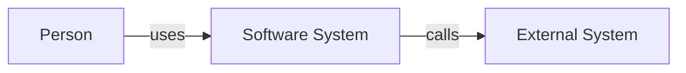
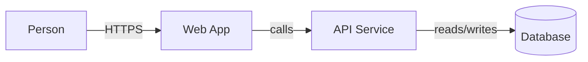
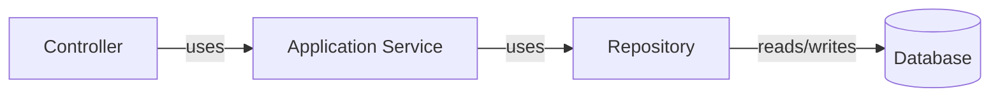
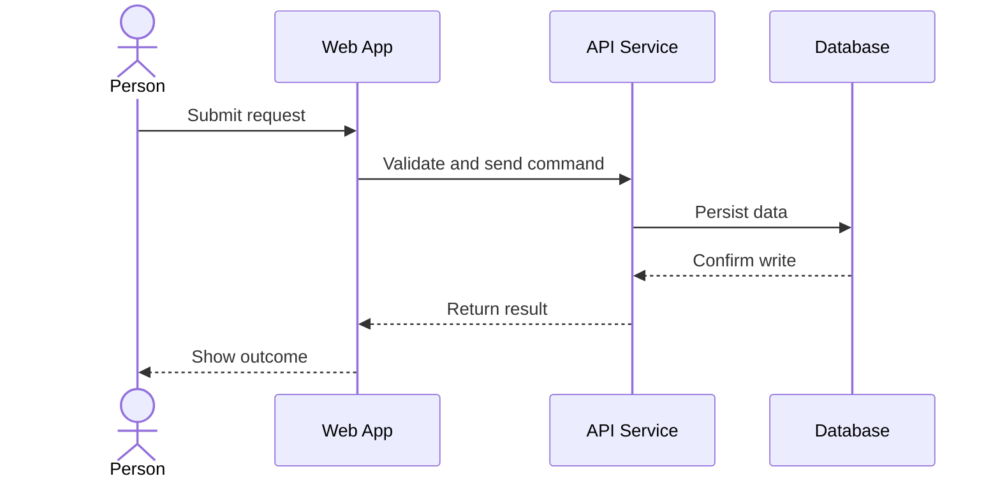
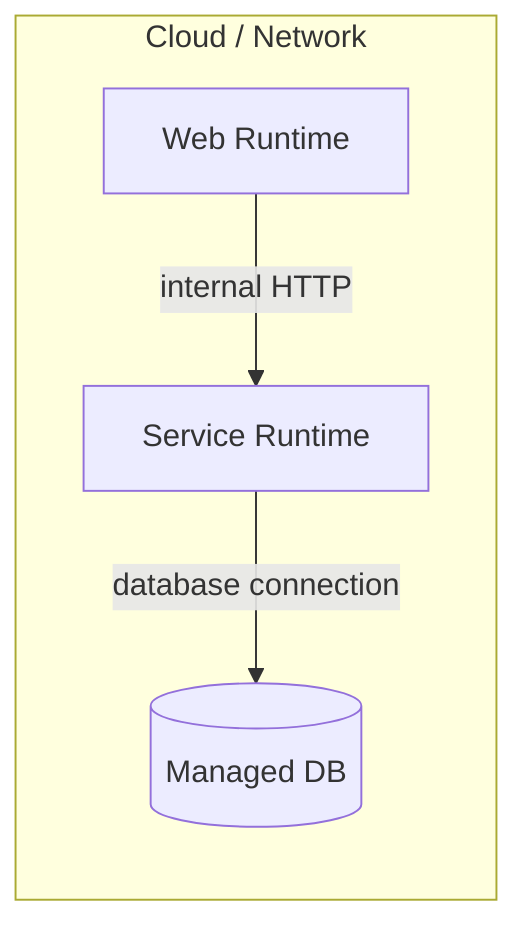

# C4 Diagram Templates

Use these as starting points. Replace generic labels with domain names from the codebase or proposed system.

## System Context

```text
+----------+        uses        +------------------+
|  Person  | -----------------> | Software System  |
+----------+                    +------------------+
                                      |
                                      | calls
                                      v
                               +------------------+
                               | External System  |
                               +------------------+
```



## Container

```text
+----------+      HTTPS       +-------------------------------+
|  Person  | ---------------> |        Software System        |
+----------+                  |                               |
                              |  +-----+   calls   +-------+  |
                              |  | Web | --------> |  API  |  |
                              |  +-----+           +-------+  |
                              |                    |          |
                              |                    v          |
                              |                 +----+        |
                              |                 | DB |        |
                              |                 +----+        |
                              +-------------------------------+
```



## Component

```text
Container: API Service

+--------------------------------------------+
|                 API Service                |
|                                            |
|  +------------+   uses   +--------------+  |
|  | Controller | -------> | Application  |  |
|  +------------+          | Service      |  |
|                          +--------------+  |
|                                  |         |
|                                  v         |
|                          +--------------+  |
|                          | Repository   |  |
|                          +--------------+  |
+--------------------------------------------+
```



## Dynamic

```text
Person -> Web App -> API Service -> Database
  |         |           |              |
  | submit  |           |              |
  +-------->| validate  |              |
  |         +---------->| persist      |
  |         |           +------------->|
  |         | response  |              |
  |<--------+-----------+--------------+
```



## Deployment

```text
+---------------- Cloud / Network ----------------+
|                                                  |
|  +--------------+       +---------------------+  |
|  | Web Runtime  | ----> | Service Runtime     |  |
|  +--------------+       +---------------------+  |
|                                  |               |
|                                  v               |
|                           +------------+         |
|                           | Managed DB |         |
|                           +------------+         |
+--------------------------------------------------+
```


