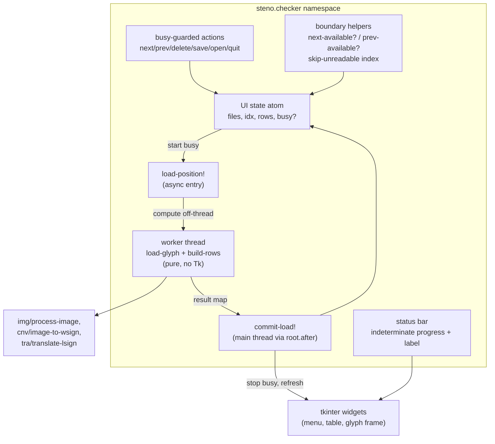
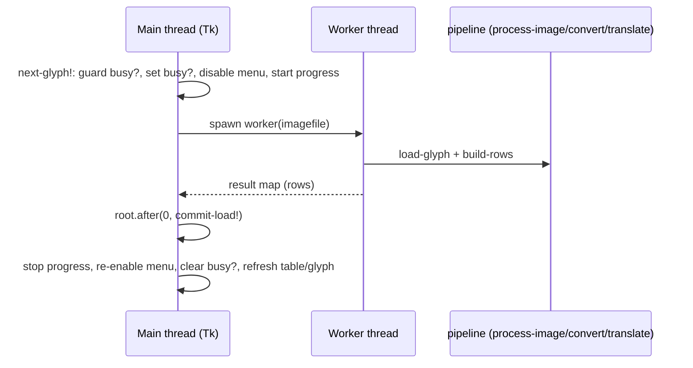

## Context

The `check` action (`checker.lpy`) reviews pre-extracted glyph images: navigation calls `load-position!` which runs `load-glyph` (`cv2.imread` → `img/process-image` → `cnv/image-to-wsign`) and `build-rows` (`tra/translate-lsign` per lsign) synchronously on the Tk main loop. When conversion + translation for one glyph takes noticeable time the window freezes: Tk queues the click events, and once the load returns the queued events replay — a double-click on Next advances twice, and repeated Save/Delete mid-session replay stale handlers. At queue ends Next/Previous return silently, and an unreadable glyph renders an empty table with no explanation. The corpus-rebuild workflow (docs/Build_corpus.org) runs the checker over hundreds of glyphs, so these stalls and silent failures accumulate.

Constraints and facts established during exploration:

- Tk is single-threaded: widgets may only be touched on the main thread; the check process has no other Tk usage.
- Both `load-glyph` and `build-rows` are pure data transforms (numpy/cv2 matrices, vectors, maps) free of Tk types, so they can run on a worker thread safely. Verified in `checker.lpy`: `build-rows` at line 51, `load-glyph` at line 42, `open-input!`/`load-position!` plumbing at 291–310.
- The queue state lives in one atom `{:files idx rows}` (make-ui, line 445); navigation (`next-glyph!` 336, `prev-glyph!` 329) only moves `idx` and reloads.
- ADR-0001 (tkinter as GUI toolkit) and ADR-0002 (corpus format preservation) are in force; neither constrains busy-state handling.
- Persian double-click symptom matches event-queue replay: blocked main loop does not drop clicks, it defers them.

Diagram conventions: lightweight C4-inspired plain Mermaid (agreed with user in the parent change). Scope here is purely internal to the check process container — this is a component-level refinement, so only a component view plus a sequence sketch of the threaded load are drawn (container/deployment are unchanged from gui-translator-checker).

### Component view (inside the check process — added parts only)

Bullets:

- **Boundary**: everything stays inside the existing `check` process; no new containers, no new capabilities in translator/corpus/converter.
- **Responsibilities**: `load-position!` becomes the async entry — it sets `:busy?`, disables actions, starts the progress bar, and spawns the worker. The worker computes `{:rows ...}` (pure data) and returns; `commit-load!` runs on the main thread via `root.after(0, …)` and does all widget touches.
- **Key relationships**: every mutation action consults the `:busy?` flag first and drops the event when set; menu items are additionally disabled during processing so Tk never queues them in the first place.
- **Assumptions**: the worker outliving a Quit is unacceptable, so Quit joins the thread (or the worker is a daemon with a short timeout); tkinter `PhotoImage`/widget updates for one glyph are fast, so the commit step does not need its own busy window.

### Sequence sketch (threaded load)

## Goals / Non-Goals

**Goals:**

- Keep the main Tk loop responsive during glyph conversion/translation so the progress bar animates and input is provably blocked.
- Guarantee no replay of navigation/mutation actions during processing (`:busy?` guard + disabled menu).
- Show processing activity in a status bar (indeterminate `ttk/Progressbar` + label like `Processing 3/12 …` / `Ready`).
- Notify at queue boundaries: Next on the last glyph → "No more glyphs to review"; Previous on the first glyph → "This is the first glyph".
- Skip forward past unreadable glyphs (imread nil or empty wsign) with a status-bar note, not a silent empty table.
- All new decision logic headless-testable (pure helpers); the Tk/thread wiring stays thin.

**Non-Goals:**

- No changes to translators, converters, corpus format, or CLI surface.
- No determinate progress (per-glyph timing is unpredictable; indeterminate is honest).
- No background processing of the whole directory — only the current glyph is processed, one at a time.
- No GUI automation tests (consistent with ADR-0001 above); manual smoke run covers the widget layer.

## Decisions

1. **Threaded worker for glyph loading (not synchronous + periodic `update_idletasks`).**
   Why: the alternative — pumping `root.update()` inside a synchronous load — concedes re-entrancy, which is the exact cause of the double-advance bug; Tk then processes the very clicks we want dropped. An off-main-thread worker keeps the loop idle so events dispatch harmlessly against the `:busy?` guard. The worker touches no widgets; the result crosses back through `root.after(0, …)`.
   Trade-off: thread-lifetime management on Quit (join / daemon + timeout). Mitigation in decision 6.

2. **Single `:busy?` flag in the existing state atom + disabled menu entries.**
   Why: one source of truth that both the guard checks and `entryconfigure(… state "disabled")` derives from; matches the existing single-atom state model (`make-ui`). Guard-first means even if a widget is not disabled (e.g. a stray keyboard binding), the event is still dropped.

3. **Status bar = indeterminate `ttk.Progressbar` + `tk.Label`, packed last under the table.**
   Why: `ttk.Progressbar` with `mode "indeterminate"` + `start`/`stop` animates while idle, which is exactly the responsive-loop window we have; a label carries the glyph count and edge/skip messages. No new dependency.

4. **Boundary and failure messages via `mb/showinfo` (user-confirmed) with symmetric Previous handling.**
   Why: an explicit modal for boundaries (user-approved), a status-label note for *skips* so whole batches of unreadable glyphs don't spam dialogs. Next past the last glyph and Previous before the first are the only two modal boundary cases.

5. **Unreadable glyphs skip forward (recommendation A, confirmed).**
   Why: batch queue traversal should advance to the next loadable glyph automatically; the skip is recorded in the status label (`Skipped unreadable glyph name.png`). Only when the whole remaining queue is unreadable does the boundary modal fire.

6. **Quit joins the in-flight worker.**
   Why: freeing Tk while a worker still touches numpy/cv2 data is safe (no widgets), but `quit-app!` should not leave a dangling thread mid-computation. Join with a short timeout; on timeout, abandon (daemonized) rather than hang the UI.

7. **Pure helper surface for headless tests.**
   Why: `next-available?` (idx vs count), `prev-available?`, `skip-unreadable-idx` (advance past unreadable entries given a predicate), `loadable-file?` wrapper, and a busy-predicate all take/return plain data. This containerizes the only new logic that isn't boilerplate Tk.

## Risks / Trade-offs

- [Tk event queue replays clicks blocked by a frozen loop] -> solved structurally: loop never freezes, actions are guard-dropped during `:busy?`, menu disabled.
- [Worker thread outlives Quit] -> join with timeout; daemon fallback documented.
- [Race: commit posted after user opened a new input] -> commit applies only if `:busy?` is still true and `idx`/`files` match what the worker started with (compare snapshot in the result map); otherwise discard.
- [Indeterminate bar misleads about magnitude] -> accepted: honest to unpredictable per-glyph cost; label carries the queue position.
- [Skip-forward hides genuinely bad inputs] -> skip is labeled per glyph; reviewer can Open the file directly to inspect.

## Migration Plan

Purely additive: new pure helpers in `checker.lpy`, `:busy?` field in the state atom, status-bar widgets in `run-checker!`, and the threaded `load-position!` split. No data migration, no CLI change. Rollback = revert `checker.lpy` (GUI behavior only).

## Open Questions

- Should the status-label message persist (e.g. "Skipped … 3 skipped") or clear on the next navigation? Default: replaced on next navigation.
- Is joining the worker on Quit sufficient, or should the app refuse to quit while busy (belt-and-braces modal)? Default for now: join-only.