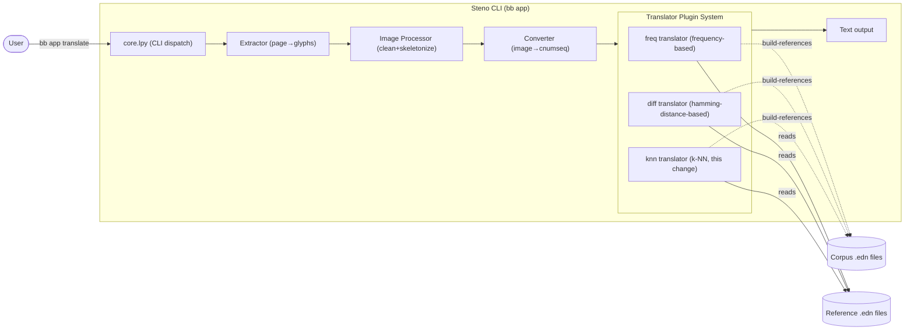

## Context

steno is a Basilisp CLI application (`bb app`) that converts scanned shorthand page images to plain text. The pipeline: Image → Extractor → Image Processor → Converter → Translator. The translator step uses a multimethod plugin system with two existing translators (`freq` and `diff`). Each registers via `defmethod` for `prepare-translation`, `translate`, and `build-references`.

The new `knn` translator adds a third plugin alongside the existing two, following the same multimethod contract. No external ML dependencies — k-NN is implemented with existing tools (numpy, statistics module).



The diagram shows the steno CLI as a single container with the translator plugin system highlighted. The `knn` translator sits alongside `freq` and `diff`, sharing the same interface, reference files, and corpus.

## Goals / Non-Goals

**Goals:**
- Add a `knn` translator plugin following the existing multimethod contract
- Implement k-NN classification with Hamming distance, sliding window, and distance-weighted voting
- Store individual corpus samples per letter (not aggregated summaries)
- Support configurable `k` (default 3)
- Auto-discovery via `--translators` CLI flag

**Non-Goals:**
- No external ML library dependencies
- No changes to the existing translator plugin architecture
- No changes to the converter, extractor, or image processor

## Decisions

### Decision 1: Algorithm — k-NN with Hamming distance

**Choice:** k-Nearest Neighbors using Hamming distance with sliding window for variable-length sequences.

**Rationale:** Hamming distance is already implemented and tested in `diff` (`get-diff` / `one-bit-num` lookup table). k-NN preserves individual writing style variations that freq/diff lose through aggregation.

**Alternatives considered:**
- *Euclidean/Manhattan distance*: Treats cnum as scalar value, losing bitfield semantics
- *DTW*: Better for non-linear stretching but adds complexity not warranted by current data

### Decision 2: Reference format — individual samples

**Choice:** Store a vector of individual normalized cnum sequences per letter:

```clojure
{:letter "t"
 :samples [[136 136 136 8] [136 136 136 136 8] ...]
 :min-len 4
 :max-len 5}
```

**Rationale:** Keeping all samples preserves the full distribution. The k-NN classifier votes across all examples, so a letter with two distinct writing styles contributes evidence for both.

**Alternatives considered:**
- *Single canonical reference (like diff)*: Loses multi-modal variation — the core motivation for k-NN.

### Decision 3: Distance-weighted voting

**Choice:** Each neighbor's match score (from `compute-match`) weights its vote. Winner = letter with highest sum of weights among the k nearest neighbors.

**Rationale:** A very close match (match=0.95) should count more than a borderline one (match=0.51). Simple majority ignores magnitude. Formula: `weight = match` for each neighbor, sum per letter.

### Decision 4: k configurable with default 3

**Choice:** `knn_k` in config.yml, default 3. Passed through context as `(:knn-k ctx)`.

**Rationale:** Small corpus means small k; 3 is standard for k-NN. Configurable for experimentation without code changes.

### Decision 5: Sliding window (reuse diff's approach)

**Choice:** Reuse `get-best-match` pattern from diff for variable-length sequences — slide the shorter reference across the longer input, find best position.

**Rationale:** Already tested and works. Consistent behavior between diff and knn reduces surprises.

### Decision 6: Registration

**Choice:** Add `[steno.translators.knn]` to the `:require` list in `core.lpy`. The `defmethod` forms auto-register with the multimethod. No changes to CLI dispatch logic.

**Rationale:** Follows the exact same pattern as `freq` and `diff`. The `--translators` flag already uses `(keys (methods tra/translate))` to discover available translators.

## Risks / Trade-offs

- **[Performance]** k-NN compares against all samples per letter, not one median. Translation may be slower than freq/diff for large corpora. *Mitigation:* samples are normalized cnumseqs (small, ~3-20 elements), and the corpus is small; if it becomes an issue, can add sample sampling.
- **[Memory]** All samples loaded into memory at startup. *Mitigation:* same risk as existing translators; reference files are `.edn` maps of modest size.
- **[Small corpus]** With very few samples per letter, k-NN may not outperform freq/diff. *Mitigation:* defaults to k=3 and works with any number of samples; with <3 samples, it effectively becomes 1-NN.

## Migration Plan

1. Create `src/steno/translators/knn.lpy` with the three multimethod entry points
2. Add `[steno.translators.knn]` require to `core.lpy`
3. Add `knn_references: "resources/knn-references.edn"` to `resources/config.yml`
4. Run `bb app make-references -t knn` to build reference data
5. Run `bb app translate -t freq diff knn` on test images to verify
6. Add tests to `test/steno/translator_test.lpy`

Rollback: Remove `knn` from `translators` list in config.yml and delete the require line.

## Open Questions

- Should k-NN be used for both type-0 and type-1 letters, or just type-1? (type-0 has only "o" and "a" with very short sequences — k-NN may not add value)
- Should the sliding window consider ALL positions (like diff) or only prefix-aligned? (design assumes all positions, consistent with diff)
