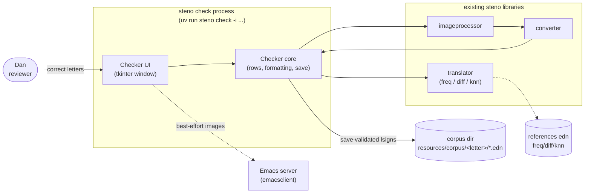
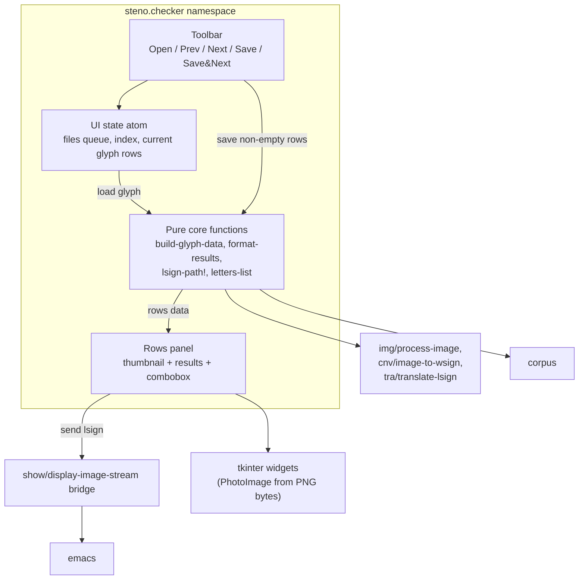

## Context

steno converts scanned Duployé shorthand pages to text via extractor → imageprocessor → converter → translator. Translators (`freq`, `diff`, `knn`) are multimethods dispatched by name; a translation context is built once from `resources/config.yml` via `tra/prepare-translations`. The corpus lives in letter subfolders (`resources/corpus/<letter>/<image>-<row>-<col>-<pos>.edn`) and is currently grown automatically by `make-corpus` under whatever letter the translators propose — mistakes pollute the corpus and the references built from it. This change adds the human-in-the-loop GUI checker described in [proposal.md](proposal.md).

Constraints and facts established during exploration:

- No GUI framework in dependencies; tkinter ships with the interpreter (Tk 8.6 verified in the project venv).
- The user works on Linux inside Emacs; `steno.show/display-image-stream` already pipes PNG bytes to Emacs via `emacsclient`.
- `img/process-image` accepts a raw grayscale image (invert → blur → skeletonize), so a pre-extracted glyph (word) image can go straight through `process-image` → `cnv/image-to-wsign`.
- `tra/translate-lsign` returns an lsign with `:letters` (one `[letter match]` pair list per translator, `match` ∈ [0,1]) and `:text` (best match).
- No repo-level ADRs exist yet (`adr/` absent); no prior architectural commitments constrain this design.

Diagram conventions: lightweight C4-inspired plain Mermaid (agreed with user); container = runnable process, components live inside it.

### Container view

Bullets:

- **Boundary**: one new runnable unit — the `check` CLI action process; it embeds the UI and reuses all existing pipeline libraries untouched.
- **Responsibilities**: the UI only collects corrections; the checker core owns wsign building, per-lsign translation, formatting, and corpus writing.
- **Key relationships**: translator context loads references EDN once at startup; saves append to the existing corpus layout; Emacs is an optional display side-channel.
- **Assumptions**: input files are pre-extracted glyph (word) images, not full pages; Emacs may be absent (dashed = best-effort).
- **Open question**: whether directory-mode should also accept page images later (excluded for now, see Non-Goals).

### Component view (inside the check process)

Bullets:

- The tkinter layer stays thin: it maps the pure row model to widgets and delegates every decision to the pure core functions.
- All headless logic (glyph loading, result formatting, path/naming computation, letter listing) sits in testable functions with no Tk types in their signatures.
- UI state is a single atom (file queue + index + current rows) so navigation is trivially serial and synchronous.

## Goals / Non-Goals

**Goals:**

- Validate/correct translator proposals per lsign before anything enters the corpus (human-in-the-loop).
- Display glyph image, each lsign thumbnail, and every configured translator's letters with probabilities; combobox pre-filled with best match.
- Accept `-i <glyph.png>` or `-i <dir>` (sorted iteration with Prev/Next, Save & Next).
- Save corrected lsigns in the exact `make-corpus` format and naming under `<corpus-dir>/<letter>/`, creating new letter folders on demand.
- Best-effort Emacs display of glyph/lsign images that degrades silently when Emacs is absent.
- Headless-testable core; zero new pip dependencies.

**Non-Goals:**

- No changes to translator algorithms, reference formats, or existing actions.
- No page-image extraction UI — inputs are already-extracted glyph images (page batching remains a future change).
- No editing of `lineseq`/`ltype` — correction is limited to choosing the true letter.
- No GUI automation tests; no cross-platform support beyond Linux.
- No concurrent/background processing.

## Decisions

1. **Toolkit: tkinter (stdlib).**
   Why: zero dependencies (Tk 8.6 verified), adequate for a form-style validation tool; images render via `cv2.imencode(".png")` → base64 → `tk.PhotoImage(data=...)`.
   Alternatives: PyQt/PySide (heavy dep for a personal tool), matplotlib widgets (poor form input), web UI (server/browser overhead), Emacs-only UI (rejected in grilling — needs a real GUI screen).

2. **Single namespace `src/steno/checker.lpy`: public pure core + private UI builders.**
   Why: matches steno's flat namespace style; keeps the testable surface obvious (pure functions take/return plain data — no Tk types). Alternatives: separate `checker.core`/`checker.ui` namespaces (more ceremony than needed here).

3. **Pipeline reuse without extraction.**
   Load = `cv2.imread(path, gray)` → `img/process-image` → `cnv/image-to-wsign`; context built once at startup via `tra/prepare-translations config translators`; each lsign translated with `tra/translate-lsign`.
   Why: honors the input contract (pre-extracted glyph); running `extract-glyphs` on a word image would be wasteful and fragile.

4. **Input handling and batch iteration.**
   `-i` accepts a file or a directory; directories expand to a sorted list of image files (`png jpg jpeg tif tiff`). A single atom holds `{files idx rows}`; Prev/Next move the index and lazily process one glyph at a time; File→Open replaces the queue. Processing is synchronous — translation of one word takes milliseconds.

5. **Row model and result presentation.**
   Each lsign becomes a row map `{:pos :matrix :results {"freq" [["t" 0.91] ...] ...} :best "t"}`. Per-translator results render as probability chains, e.g. `t(0.91) l(0.75)`; the combined best match (`:text`) labels the row and pre-fills its combobox. Combobox values come from existing corpus subfolders; free text creates a folder on save; empty means skip.

6. **Corpus save semantics identical to `make-corpus`.**
   Saved keys exactly `{:ltype :lineseq :fileimage :row :column :pos}` (translator annotations stripped); since there is no page matrix, `row`/`column` pin to 0 and `pos` is the wsign index; filename `<image>-00-00-<pos>.edn` via the same `format` convention; written with `utl/save-edn` into `<corpus-dir>/<letter>/`, parents created as needed. Overwriting an existing file for the same source position is intended replacement (idempotent curation).

7. **Best-effort Emacs bridge.**
   Reuse the `show.lpy` mechanism (matplotlib figure → PNG bytes → `emacsclient`): glyph auto-sent on open, per-row button sends the lsign matrix (`utl/lineseq-to-matrix`). Every send wrapped in try/catch plus a subprocess timeout so a missing Emacs never blocks the GUI.

8. **Testing strategy.**
   `test/steno/checker-test.lpy` covers the pure helpers (row building from a loaded glyph, result formatting, path/filename computation, letter listing, skip filtering). The widget layer gets a manual smoke run only — consistent with how the rest of steno is tested (`bb test`, basilisp.test).

## Risks / Trade-offs

- [Tk `PhotoImage(data=...)` requires Tk ≥ 8.6] -> verified in venv; fallback path writes temp PNGs and loads by filename if base64 misbehaves.
- [Basilisp function objects passed as Tk callbacks] -> use named `defn` callbacks (same-thread invocation); avoid raw closures where interop is finicky.
- [`emacsclient` hangs when no server runs] -> wrap sends in try/catch with a short `subprocess` timeout; failure is logged at debug level only.
- [Typo in free-typed letter creates a junk corpus folder] -> combobox lists existing letters first; save logs destination paths; folders are trivially removable.
- [Silent overwrite of an existing corpus file] -> accepted trade-off: same source position means the same sign, saving is deliberate curation; overwrite noted in the log line.
- [Directory mode fed a page image by mistake] -> produces odd wsigns but cannot corrupt anything outside the corpus dir; documented assumption; page support explicitly out of scope.
- [Non-ASCII letter folders (`ţ`)] -> already present in today's corpus; Python/Linux handle UTF-8 paths; no extra work.

## Migration Plan

Purely additive: new `checker.lpy`, new test file, one `actions` entry + `:require` in `core.lpy`. No data migration; the corpus changes only when a user saves through the app. Rollback = delete the new files and remove the action registration.

## Open Questions

- Final accepted extension list for directory mode (proposed `png jpg jpeg tif tiff`)?
- Should `knn` join the default `translators` list in `config.yml` once this tool lands (separate config decision, not part of this change)?
- Future ADR candidates to record after implementation: tkinter-as-GUI-toolkit choice; corpus-format preservation contract between `make-corpus` and the checker.
